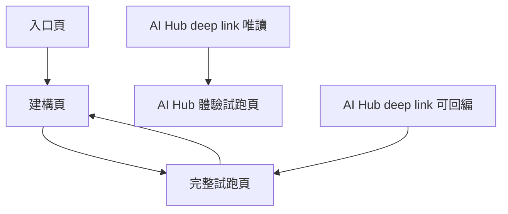

# User Journeys

## 目的

這份文件描述 Playground V2 的主要使用者旅程。它不只描述頁面跳轉，也描述每一步使用者想完成什麼、系統應該如何回應。

## Journey A: 手動匿名建立並試跑

### 使用者目標

快速建立一份 Workflow，試玩它，最後帶走 `.py`，但不需要登入也不需要保存到 AI Hub。

### 旅程

1. 進入入口頁
2. 選擇匿名使用
3. 進入建構頁
4. 建立或調整 Workflow
5. 點擊進入試跑頁
6. 試跑、測試互動效果
7. 打開 code preview 小視窗
8. 匯出 `.py`

### UX 關鍵點

1. 匿名模式不可被 AI Hub 保存提示干擾。
2. 建構頁要優先幫他成功生成，而不是暴露過多系統細節。
3. 試跑頁要清楚顯示「你尚未登入，因此不會保存」。

## Journey B: 手動登入建立並保存

### 使用者目標

建立或修改一份 Workflow，試跑驗證後保存回 AI Hub。

### 旅程

1. 進入入口頁
2. 輸入 AI Hub 帳號與密碼
3. 驗證成功
4. 進入建構頁
5. 建立或修改 Workflow
6. 進入試跑頁
7. 試跑並驗證互動表現
8. 若需要，返回建構頁修正
9. 保存到 AI Hub

### UX 關鍵點

1. 登入後不再問「新建還是載入」，直接進建構頁。
2. 如果系統已從 AI Hub 讀到先前保存內容，建構頁頂部必須明確提示。
3. 保存成功後，試跑頁要顯示最新保存時間與成功狀態。

## Journey B2: 行政 / FAE 建立後交給第一線使用

### 使用者目標

建立者不是自己要長期使用 Agent，而是要把 Agent 做成可交給門市、客服或其他第一線人員直接使用的任務頁。

### 旅程

1. 建立者登入
2. 進入 Builder 設定 Agent
3. 用 Runner 預覽實際使用體驗
4. 檢查輸入方式、結果呈現、依據與下一步操作是否適合第一線
5. 保存到 AI Hub
6. 將 Agent 交給直接使用者使用

### UX 關鍵點

1. Builder 不能只協助技術上可執行，還要讓建立者有機會在 Runner 預覽實際效果。
2. Runner 必須同時能被建立者拿來預覽，以及被第一線拿來直接使用。
3. 建立者需要知道自己做出的 Agent，第一線看到的會是什麼樣子。

## Journey C: AI Hub 導流唯讀體驗

### 使用者目標

從 AI Hub 直接進來玩一個既有 Workflow，但不需要也不應該看到設定或程式碼。

### 旅程

1. 在 AI Hub 點選既有 Workflow 或 Agent
2. AI Hub deep link 導到 Playground Host
3. Playground 直接打開試跑頁
4. 使用者聊天、上傳附件、看結果
5. 頁面以 Powered by Agentic SDK 標示來源

### UX 關鍵點

1. 不經過入口頁。
2. 不顯示 code preview。
3. 不顯示返回建構頁。
4. 整體視覺要更接近公開體驗頁，而不是工程工具。

## Journey C2: 第一線直接使用既有 Agent

### 使用者目標

直接進入 Agent 頁完成工作，例如問答、推薦、填寫條件、查看建議，而不理解背後 workflow。

### 旅程

1. 使用者從 AI Hub、內部入口或分享入口開啟 Agent
2. 直接進入 Runner 的實際使用頁面
3. 依畫面指示輸入需求、資料或附件
4. 查看結果、建議、依據與下一步
5. 視權限結束、重試或再次輸入

### UX 關鍵點

1. 使用者不應先看到 Builder 語言。
2. 使用者不應先看到 workflow 身分、code、source。
3. 頁面要先回答「這裡能幫你完成什麼工作」。
4. 結果需要有足夠信任層與下一步操作。

## Journey D: AI Hub 導流可回編

### 使用者目標

從 AI Hub 打開既有 Workflow，先體驗目前版本，再依需要回建構頁更新，最後保存回 AI Hub。

### 旅程

1. 在 AI Hub 點既有 Workflow
2. Playground 直接打開試跑頁
3. 試跑目前版本
4. 若覺得需要調整，點擊「回到建構頁更新配置」
5. 在建構頁修改 Workflow
6. 再次進入試跑頁驗證
7. 保存回 AI Hub

### UX 關鍵點

1. 預設先體驗，再決定是否回編。
2. 試跑頁必須清楚標示：你正在操作的是 AI Hub 既有 Workflow。
3. 回建構頁後，頁面要維持「更新既有 Workflow」語境，而不是回到空白建立狀態。

第一線回饋如何蒐集與建立者如何收到，屬於平台工程與營運閉環議題，不是 Runner 主頁面的核心旅程。

## Journey 對應頁面關係

## 應避免的旅程斷點

1. 登入後還要再選一次「新建/載入」。
2. AI Hub 唯讀體驗者誤闖建構頁。
3. AI Hub 可回編者看不到返回建構頁更新的入口。
4. 匿名使用者以為自己的內容已被 AI Hub 保存。

## PM 驗收問題

1. 每條旅程是否只有必要步驟。
2. 模式切換是否只在必要時發生。
3. 所有模式是否都能落到試跑頁作為互動驗證中心。