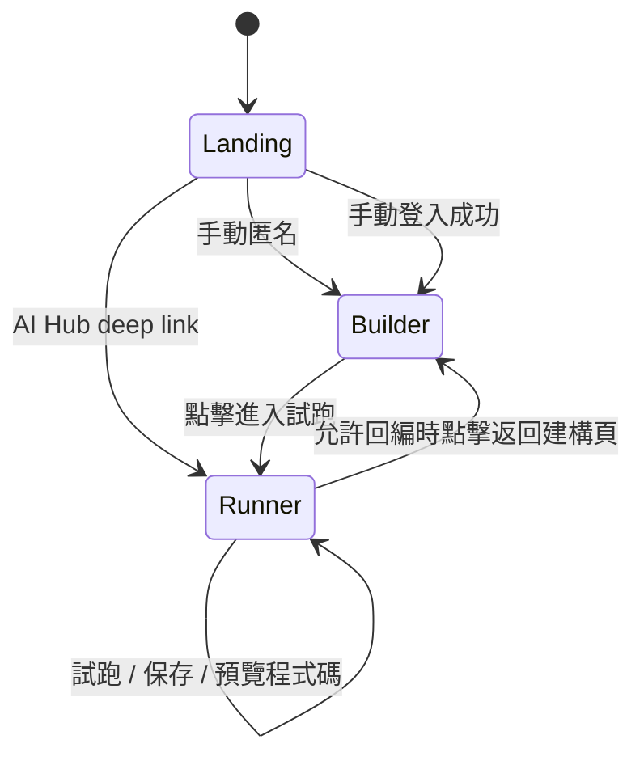

# Route and State Map

## 目的

這份文件定義 Playground V2 的 URL、頁面狀態與跳轉規則。它是 Flask route 規劃與前端模式切換的共同依據。

## 路由建議

| Route | 方法 | 用途 |
| --- | --- | --- |
| `/playground/` | GET | 入口頁。若偵測到合法 AI Hub deep link，直接改導到試跑頁 |
| `/playground/auth/login` | POST | 驗證 AI Hub 帳號密碼 |
| `/playground/builder` | GET | 建構頁 |
| `/playground/run` | GET | 試跑頁 |
| `/playground/run/execute` | POST | 執行目前 Python Workflow |
| `/playground/run/profile` | GET | 取得由當前 Python source 推導的 runner scene profile 與 capability map |
| `/playground/source/export` | POST | 匯出目前 Python source 為 `.py` |
| `/playground/source/preview` | GET | 取得 code preview 內容 |
| `/playground/aihub/config/load` | POST | 由 host 端呼叫 AI Hub 載入既有 Python source |
| `/playground/aihub/config/save` | POST | 由 host 端呼叫 AI Hub 保存既有 Python source |

## URL 規則

### 手動進站

1. `/playground/` 顯示入口頁。
2. 匿名或登入成功後，導到 `/playground/builder`。

### AI Hub deep link 進站

1. `/playground/` 若偵測到合法 deep link context，不顯示入口頁。
2. 直接導到 `/playground/run`。

## 建議狀態模型

### Session scope state

由 Flask session 或等價 host-side session 保存：

1. `mode`: `anonymous` / `manual_auth` / `aihub_readonly` / `aihub_editable`
2. `account_context`: 是否有已驗證帳號上下文
3. `agent_id`: 目前綁定的 Agent 識別值，可為空
4. `python_source`: 目前工作中的 Python source string
5. `source_origin`: `manual_new` / `aihub_loaded` / `aihub_shared_readonly`
7. `runner_scene_profile`: 可選，由當前 source 派生或 host 臨時建立

### Client scope state

只保存暫時 UI 狀態，不可成為正式來源：

1. 建構頁目前展開哪個模組
2. 試跑頁 code preview 是否展開
3. 未送出的聊天輸入
4. 尚未提交的附件預覽
5. 目前啟用哪些 runner slot panel

## 狀態跳轉圖

## Deep link 行為規則

### 唯讀 deep link

最低要求：

1. 具備既有 Python source
2. 模式標記為唯讀
3. 不建立 builder entry

### 可回編 deep link

最低要求：

1. 具備既有 Python source
2. 具備安全可驗證的帳號上下文
3. 允許顯示返回建構頁與保存到 AI Hub 功能

## 安全規則

1. 不允許把明文密碼放在 URL query string。
2. AI Hub 帶來的帳號上下文必須由 host 安全解析成 session，不可原樣暴露在前端。
3. 若 deep link 缺少必要上下文，應降級為唯讀體驗或拒絕進入，而不是默默給編輯權限。

## Builder 進入條件

可進入 `/playground/builder` 的條件：

1. 手動匿名模式
2. 手動登入模式
3. AI Hub 可回編模式，且從試跑頁明確操作返回建構頁

## Runner 進入條件

可進入 `/playground/run` 的條件：

1. 已存在可執行的 `python_source`
2. 或由 AI Hub deep link 直接提供既有 `python_source`

進入後，host 可額外建立非持久化 `runner_scene_profile`，用來決定這個 Agent 在 runner 上啟用哪些場景化區塊。

同時，host 可依角色與權限自動調整 Runner 的資訊密度與可見操作，但不需要把這些差異暴露成前台正式模式名稱。

## 錯誤導向規則

1. 若手動使用者直接進 `/playground/run` 但沒有 `python_source`，導回 builder。
2. 若 AI Hub deep link 缺少有效 source，顯示專屬錯誤頁或錯誤面板，不導入 builder。
3. 若 AI Hub deep link 指示 editable 但沒有安全帳號上下文，降級為 readonly。

## PM 驗收項目

1. 是否不存在多餘的「建立方式頁」。
2. 手動進站是否必然導向 builder。
3. AI Hub deep link 是否必然導向 runner。
4. 權限不足時是否安全降級，而不是失控放權。