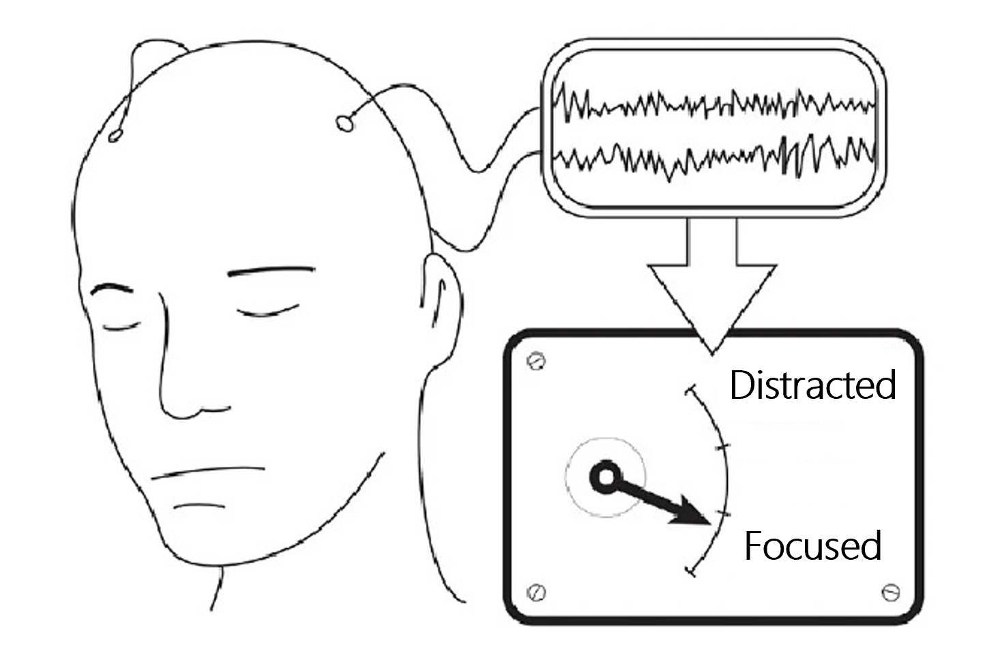

# BCI 射箭教練

BCI 射箭教練是一套用於訓練判讀情境的輔助系統，協助教練整合腦波、姿態、動作抖動、心率與主觀回饋，形成可執行的調整建議。系統接收多模態輸入與當輪提問，整理出可追蹤的判讀條件，並將歷史證據收斂成連續回合可沿用的訓練建議。

## Problem

在高強度訓練場景裡，失準片段很少只對應單一原因。腦波、姿態、動作抖動、心率與主觀回饋往往同時發生變化，教練必須在很短時間內判斷哪些變化值得被視為線索，哪些只是陪襯訊號。只要這個判讀過程停留在逐項查看資料，結論就容易卡在描述層，難以形成穩定、可執行的調整建議。

真正的壓力出現在第二輪之後。當同一位教練從「後三箭為何失穩」改問成「如何調整節奏」或「是否和疲勞累積有關」時，原本的分析常常要被迫重來一次。這不只讓訓練判斷依賴個別教練的臨場整合能力，也讓不同回合之間很難維持一致的判讀脈絡。

## Solution

BCI 以 Agentic SDK 支援的 workflow 串起完整判讀主線，讓多模態輸入、歷史證據與當輪提問留在同一條處理鏈上。系統先收進當輪訊號與問題，整理出需要被優先判讀的條件，再依條件決定應該回查哪些歷史片段與標註內容，最後把這些證據收斂成教練可以直接採取的調整建議。

圖 1 所示的樣本輸入，就是這條主線的起點。對系統來說，這些腦波、姿態、動作抖動與心率訊號並不是分開閱讀的資料列，而是會先被整理成同一輪判讀可以使用的條件，後續回查與建議生成也都圍繞這組條件展開。

圖 1. BCI 樣本輸入，用來呈現系統如何從多模態訊號建立判讀條件，並將後續回查與建議生成收斂到同一條訓練決策主線。

這種設計的價值，在於它支撐的是一段可以隨提問變動持續推進的訓練流程。當同一位教練在下一輪改寫問題時，系統承接的是既有條件與歷史證據，不必重新把所有訊號攤開再分析一次。

## Proof of Concept

以「後三箭為何失穩」為例，workflow 的第一輪任務，是先把分散訊號收斂成同一段可推進的判讀流程。系統接到問題之後，會先從當輪輸入整理出真正需要優先處理的條件，再沿著這組條件回查對應的歷史片段與標註內容。最後得到的，不會只是零散觀察，而是一段把當輪異常、過往證據與修正方向整合過的建議，讓教練能立即進入調整。表 1 整理了這一輪判讀流程中各模組的責任位置與交互參照。

| 模組 | 在此案例中的處理內容 |
| --- | --- |
| Perceive | 將腦波、姿態、動作抖動、心率與主觀回饋收斂成可判讀條件 |
| Plan | 依照這些條件決定本輪優先追查哪些歷史片段與標註脈絡 |
| Retrieve | 帶回對應片段與標註內容，形成後續判讀依據 |
| Action | 將條件與證據整理成教練可直接採取的建議 |
| Reflect | 檢查這一輪訓練建議是否已回應失穩原因，若不足則標出需要補回的歷史片段或標註證據 |

表 1. BCI 判讀流程中的五模組交互參照，用來說明各模組在第一輪分析中的責任位置。

多模態判讀的連續性，建立在條件整理、證據回查與建議生成之間的穩定接續。腦波、姿態、動作抖動、心率與主觀回饋會先被收斂成同一輪判讀條件，這組條件接著決定歷史片段與標註內容的回查方向。當對應證據被帶回來之後，系統再把當輪異常、歷史脈絡與調整方向整理成教練可以直接採取的建議，讓整個判讀過程從訊號整理一路收斂到訓練決策。

真正的 proof 出現在第二輪問題改寫之後。當教練接著問「如何調整節奏」或補充「這種失穩是否和疲勞累積有關」時，系統不會把前一輪的判讀基礎全部清空，而會沿用 Perceive 已經整理出的條件、沿用 Retrieve 已帶回的歷史證據，再由 Plan 重新排序這一輪最需要被優先處理的判斷重點。Action 因此重組出的，是在既有脈絡上修正後的下一步判斷。對教練而言，這種承接能力比單次回答更重要，因為它決定了訓練流程是否真的能在連續回合中維持一致。

所以這個 PoC 最後證明的是，Agentic SDK 能把多模態輸入、歷史證據與連續提問維持在同一條可追溯的決策鏈上。只要第二輪問題進來之後，系統仍然能延續前一輪已建立的條件與證據，持續推進下一步判讀，這條訓練判讀主線才算真正成立。

## Summary

BCI 射箭教練這個案例最後建立的，是一套能在連續回合中維持判讀一致性的訓練決策流程。對教練來說，建議不再停留在分散觀察，而能始終回扣到當輪訊號與歷史證據；對訓練團隊來說，感測來源擴張、標註規則更新與建議模板調整，都可以在既有主線上持續演進，而不必每次都重建整段分析邏輯。