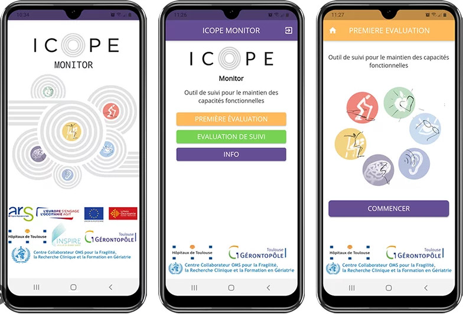

# ICOPE 六力評估助手

ICOPE 六力評估助手是一套用於居家照護情境的評估系統，協助家屬、照顧者與遠距照護人員整理六力結果、補充觀察與追蹤紀錄。系統接收個案填寫結果、家屬觀察與歷史紀錄，整理出可判讀條件，並將風險排序與照護建議收斂成可共讀的評估摘要。

## Problem

在 ICOPE 情境裡，六力評估的難點從來不只是完成量表，而是把行動、認知、活力、視力、聽力與心理狀態放進同一次判讀。個案本人在居家端完成填寫後，家屬或照顧者常常還會補充近況觀察，遠距照護人員則需要把這些內容和追蹤紀錄放在一起理解。真正需要被完成的，不只是六力結果的閱讀，而是風險排序、追蹤建議與轉介方向之間的連結。只要這段連結完全依賴人工逐項比對，同一份資料就可能在不同角色手上得到不同理解，後續照護建議也會逐漸脫離評估證據本身。

真正的壓力出現在第二輪之後。當個案完成第一輪六力篩檢後，家屬或照顧者常常還會補上新的生活觀察，例如近三個月體重下降、行走速度變慢、近期聽力明顯退化，或追蹤時再次出現情緒低落。只要每次補充都要重新整理一遍六力風險、追蹤順序與建議內容，居家端與照護端之間的判讀脈絡就會中斷，評估流程也會變得冗長。

## Solution

ICOPE 六力評估助手以 Agentic SDK 支援的 workflow 重建整段照護主線，讓個案填寫結果、家屬補充觀察、歷史追蹤與建議生成留在同一條處理鏈上。系統先收進六力量測結果與當輪提問，整理出需要被優先判讀的能力面向，再依條件決定應該回查哪些歷史紀錄、對照哪些風險線索，最後把這些證據收斂成家屬、照顧者與遠距照護人員都能共用的判讀摘要與追蹤建議。

圖 1 所示的 ICOPE 樣本，就是這條主線的起點。對系統來說，行動、認知、活力、視力、聽力與心理狀態並不是分開閱讀的欄位，而是會先被整理成同一輪評估可以使用的條件，後續風險回查與建議生成也都圍繞這組條件展開。

圖 1. ICOPE 樣本輸入，用來呈現系統如何從六力評估欄位建立判讀條件，並回扣到風險排序、追蹤與照護建議。

這種設計的價值，在於它支撐的是一段可以隨補充資訊持續推進的評估流程。當家屬、照顧者或遠距照護人員在下一輪補上新的症狀、量測或生活觀察時，系統承接的是既有條件與歷史證據，不必讓不同角色各自重新整理整份六力評估一次。

## Proof of Concept

以「這位長者目前需要優先追蹤哪些六力風險」為例，workflow 的第一輪任務，是先把六力評估結果與當輪需求收斂成同一段可推進的判讀流程。系統接到問題之後，會先從行動、認知、活力、視力、聽力與心理面向整理出真正需要優先處理的條件，再沿著這組條件回查既有紀錄中的症狀變化、追蹤結果與照護備註。最後得到的，不會只是六力結果的逐欄重述，而是一段把評估證據、風險排序與追蹤方向整合過的判讀說明，讓家屬、照顧者與遠距照護人員第一次就能共享哪些能力面向應該被優先處理。表 1 整理了這一輪評估流程中各模組的責任位置與交互參照。

| 模組 | 在此案例中的處理內容 |
| --- | --- |
| Perceive | 將六力欄位、家屬補充觀察與當輪提問整理成可判讀條件 |
| Plan | 依照這些條件決定本輪優先檢視哪些能力面向、追蹤紀錄與風險線索 |
| Retrieve | 帶回歷史量測、追蹤備註與照護紀錄，形成後續評估依據 |
| Action | 將條件與證據整理成家屬、照顧者與遠距照護人員可共讀的追蹤建議 |
| Reflect | 檢查這一輪追蹤建議是否足以支撐照護判讀，若不足則標出需要補回的紀錄或風險線索 |

表 1. ICOPE 評估流程中的五模組交互參照，用來說明各模組在第一輪判讀中的責任位置。

六力評估的穩定性，建立在條件整理、歷史回查與照護建議之間的連續對應。行動、認知、活力、視力、聽力與心理狀態會先被整理成同一組判讀條件，這組條件接著決定追蹤紀錄的檢視方向，包括近期功能變化、家屬觀察與既有照護備註。當相關證據被帶回來之後，系統再把能力風險、歷史脈絡與照護方向整理成各角色都能共同理解的建議，讓整段評估從六力判讀一路收斂到追蹤順序與照護分工。

真正的 proof 出現在第二輪補充資訊進來之後。當家屬補上「近三個月體重下降」或照顧者反映「近期聽力明顯變差」時，系統不會把前一輪的評估基礎全部清空，而會沿用 Perceive 已經整理出的六力條件、沿用 Retrieve 已帶回的追蹤紀錄，再由 Plan 重新排序這一輪最需要優先處理的風險面向。Action 因此重組出的，是在既有脈絡上修正後的追蹤建議。對家屬、照顧者與遠距照護人員而言，這種承接能力比第一次判讀更重要，因為它決定了六力評估能不能在連續追蹤中維持一致。

所以這個 PoC 最後證明的是，Agentic SDK 能把六力欄位、歷史紀錄與連續提問維持在同一條可追溯的決策鏈上。只要條件改變之後，系統仍然能延續前一輪已建立的評估基礎與照護證據，持續推進追蹤與照護建議，這條 ICOPE 照護主線就算真正成立。

## Summary

ICOPE 六力評估助手這個案例最後建立的，是一套能在連續追蹤中維持評估一致性的居家照護決策流程。對家屬、照顧者與遠距照護人員來說，六力建議能始終回扣到當輪評估與歷史紀錄，並維持共同的判讀脈絡；對系統維運團隊來說，量測欄位調整、追蹤規則更新與建議模板優化都可以在既有主線上持續演進，而不必每次都重寫整段評估邏輯。