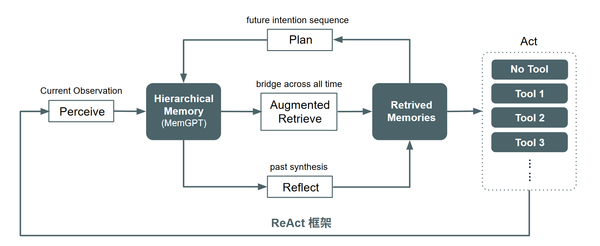

# Workflow Overview

`Workflow` 是 Agentic SDK 的公開組裝入口。它負責把可用節點接成一條可執行流程，並在執行期間承接節點之間的狀態流轉。單次執行實際會走到哪些節點，取決於各節點回傳的 `next_node`。

這一頁先說明 `Workflow` 的公開組裝方式、執行時如何保存中間資料，以及一條 workflow 在 runtime 中如何被推進。

## 公開組裝模型

!!! info "公開契約"
    所有需要模型的節點，一律以 OpenAI SDK 相容介面接入。

```python
Workflow(
    perceive=...,
    plan=...,
    retrieve=...,
    action=...,
    reflect=...,
)
```

`Workflow` 建立完成後，未顯式指定的節點會由內建預設實作補上；但某個節點會不會真的在這次執行中被走到，仍取決於前一節點回傳的 `next_node`。執行期間，`Workflow` 會在內部建立一份 `WorkflowState`，公開別名為 `InContextMemory`，用來保留輸入內容、中繼結果與節點中繼資料。

在這套文件定義裡，workflow 執行期間會持續讀寫同一份內部資料物件；這份物件在文件裡統一寫成 `Entities`。

下圖整理目前文件站採用的 workflow 執行模型：



圖 1：workflow 在單次執行期間的推進方式。

## 執行狀態

`Workflow` 執行時會持續更新一份共用狀態，讓後續節點可以讀取前一步留下的結果。這份狀態的公開別名是 `InContextMemory`，也是預設 workflow engine 在單次 run 中承接資料的方式。

你可以把這份狀態理解成一個隨節點推進而持續更新的工作記憶：前面的節點把結果寫進去，後面的節點再從同一份狀態讀取並追加結果。這樣的設計讓 workflow 不需要在節點之間額外搬運多份獨立物件，而是透過同一份執行狀態推進整條流程。

## 執行流程

一條 workflow 啟動後，會從起始節點開始執行。每個節點都會讀取目前的 `WorkflowState`，完成自己的處理，再回傳包含 `next_node` 的 `NodeOutput`。`Workflow` 會根據這個結果決定下一個要執行的節點，直到某個節點回傳結束條件為止。

這種設計的重點不是把流程寫死，而是讓節點在 runtime 中決定接下來要把控制權交給誰。也因此，同一個 `Workflow` 物件可以支援不同長度、不同分支的執行路徑。

## README 流程對應

README 裡的幾個範例，實際上都是在示範同一個公開組裝模型可以如何替換節點組合：你可以保留預設實作，也可以只替換其中一個節點，或另外注入自訂節點物件。對 `Workflow` 來說，這些差異都會回到同一套執行規則，也就是讀取 `WorkflowState`、執行目前節點、根據 `next_node` 推進下一步。

如果你要進一步看 workflow 執行時由哪一層承接這份狀態，下一步應該看 [Workflow 引擎選項](workflow-engines.md)。

## Entities

`Entities` 是 workflow 內部節點交換資料時使用的核心標準物件，用來描述 workflow 在單次執行期間會持續累積與更新的中間資料。

```json
{
    "user_message": "",
    "perceive_query": "",
    "perceive_label": "",
    "perceive_summary": "",
    "next_node": "",
    "retrieve_query": "",
    "plan_reason": "",
    "retrieved_items": [],
    "retrieved_snippet": "",
    "retrieved_hit_count": 0,
    "retrieved_source": "",
    "action_status": "",
    "final_message": "",
    "action_error": "",
    "reflect_verdict": "",
    "reflect_reason": ""
}
```

像是 `input_fields`、`input_images`、`response_schema`、`final_data`、`reflect_patch` 這類欄位，仍可以存在各節點自己的輸入輸出規格裡；只是它們不屬於所有節點都必須共享的核心 `Entities`。

## 文件站閱讀路徑

| 你現在要做的事 | 先看哪一頁 | 再看哪一頁 |
| --- | --- | --- |
| 理解 workflow 怎麼組 | Workflow Overview | [Workflow 引擎選項](workflow-engines.md) |
| 理解 workflow 預設使用哪個引擎 | [Workflow 引擎選項](workflow-engines.md) | [Module Family](modules/index.md) |
| 直接找某一類模組規格 | [Module Family](modules/index.md) | 對應的功能模組頁 |

下一步建議先看 [Workflow 引擎選項](workflow-engines.md)，再回到 [Module Family](modules/index.md) 與各功能模組頁查節點規格。