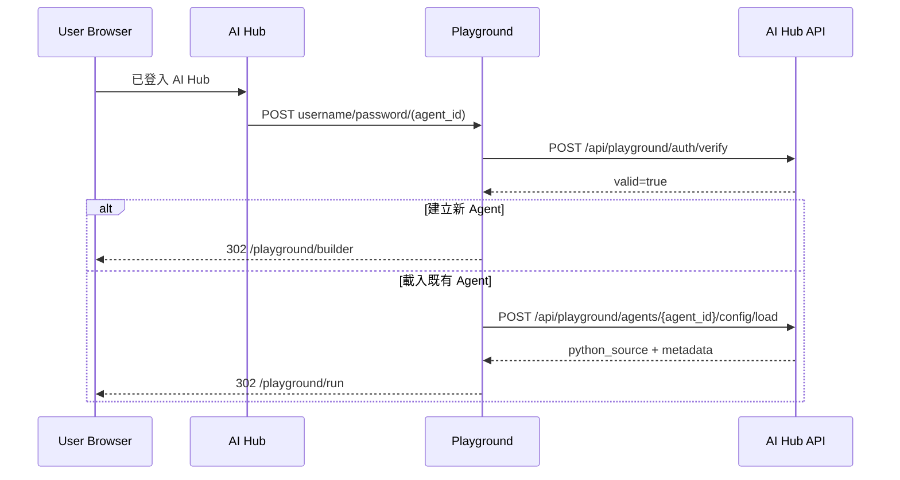

# AI Hub 到 Playground 導航

這份文件定義 AI Hub 在使用者已登入 AI Hub 的情況下，如何把瀏覽器導向 Agentic SDK Playground。Playground 目前支援兩條入口：建立新 Agent 直接進 Builder，以及載入既有 Agent 直接進 Runner。

> 不要把帳號密碼放在 query string。AI Hub 應使用 HTTPS top-level `POST` 表單導向 Playground，讓 Playground 驗證帳密後建立自己的 session cookie。

## 導航目標

| 場景 | AI Hub 已知資料 | Playground endpoint | 成功後頁面 |
| --- | --- | --- | --- |
| 建立新 Agent | `username`, `password` | `POST /playground/aihub/navigation/builder` | `/playground/builder` |
| 載入既有 Agent | `username`, `password`, `agent_id` | `POST /playground/aihub/navigation/runner` | `/playground/run` |

Playground 不會把密碼寫入前端 local storage 或 URL。驗證成功後，只會在 server-side session 建立一張暫存 credential ticket，後續 Runner save/reload 會用這張 ticket 呼叫 AI Hub API。

## 建立新 Agent：直接進 Builder

AI Hub 使用者按下「建立 Agent」時，AI Hub 可以建立一個隱藏表單並提交到 Playground：

```html
<form id="open-playground-builder" method="post" action="https://agentic-sdk-playground.azurewebsites.net/playground/aihub/navigation/builder">
  <input type="hidden" name="username" value="admin">
  <input type="hidden" name="password" value="admin">
</form>
<script>
  document.getElementById("open-playground-builder").submit();
</script>
```

Playground 收到後會：

1. 呼叫 AI Hub `POST /api/playground/auth/verify` 驗證帳密。
2. 建立 `manual_auth` session 與 server-side credential ticket。
3. 清除既有 `agent_id` / `agent_name` / save 狀態。
4. 建立預設 Python source。
5. `302` redirect 到 `/playground/builder`。

使用者在 Builder/Runner 調整完成後按「儲存」，Playground 會呼叫 AI Hub `POST /api/playground/config/save`。如果 session 尚無 `agent_id`，AI Hub 會建立新 Agent 並回傳 `agent_id`，Playground 會把它保存在 session，之後 save/reload 都會針對同一個 Agent。

## 載入既有 Agent：直接進 Runner

如果 AI Hub 已有過去由 Playground save 出來的 Agent 紀錄，AI Hub 可以帶 `agent_id` 直接開啟 Runner：

```html
<form id="open-playground-runner" method="post" action="https://agentic-sdk-playground.azurewebsites.net/playground/aihub/navigation/runner">
  <input type="hidden" name="username" value="admin">
  <input type="hidden" name="password" value="admin">
  <input type="hidden" name="agent_id" value="agt_dbc780b2d07445ef">
</form>
<script>
  document.getElementById("open-playground-runner").submit();
</script>
```

Playground 收到後會：

1. 呼叫 AI Hub `POST /api/playground/auth/verify` 驗證帳密。
2. 用同一組 credential 呼叫 AI Hub `POST /api/playground/agents/<agent_id>/config/load`。
3. 將 session 設為 `aihub_editable`。
4. 寫入 `agent_id`、`agent_name`、`python_source` 與 server-side credential ticket。
5. `302` redirect 到 `/playground/run`。

Runner 進入後，使用者可以：

| 動作 | Playground route | AI Hub API |
| --- | --- | --- |
| 儲存 | `POST /playground/aihub/config/save` | `POST /api/playground/config/save` |
| 重新載入 | `POST /playground/aihub/config/reload` | `POST /api/playground/agents/<agent_id>/config/load` |

## 前端導航建議

AI Hub 前端請使用 top-level form POST，而不是 `fetch` 或 query string：

- form POST 會讓瀏覽器正式切到 Playground 網域，Playground 可以正常設定 session cookie。
- query string 會把密碼留在瀏覽器歷史、proxy log、server log 與 referrer 風險中。
- cross-origin `fetch` 不適合拿來建立 Playground 的瀏覽器 session；即使 API 成功，使用者畫面也不會自然進入 Builder/Runner。

AI Hub 可以把表單放在目前頁面提交，也可以開新分頁：

```html
<form method="post" target="_blank" action="https://agentic-sdk-playground.azurewebsites.net/playground/aihub/navigation/runner">
  <input type="hidden" name="username" value="{{ username }}">
  <input type="hidden" name="password" value="{{ password }}">
  <input type="hidden" name="agent_id" value="{{ agent_id }}">
  <button type="submit">在 Playground 編輯</button>
</form>
```

## 後端責任邊界



錯誤處理：

| 錯誤 | Playground 行為 |
| --- | --- |
| 帳密缺漏或驗證失敗 | 回到登入頁並顯示錯誤，HTTP 400 |
| `agent_id` 缺漏 | 回到登入頁並顯示 `Missing AI Hub agent id.`，HTTP 400 |
| AI Hub load config 失敗 | 回到登入頁並顯示 AI Hub 回傳錯誤，HTTP 502 |

## 後續安全升級

目前 contract 依使用者要求支援 AI Hub 直接帶帳密做 browser handoff。正式長期版本建議改成一次性 handoff token：AI Hub 後端發 token，Playground 用 token 向 AI Hub 換取短效 session 或 scoped credential。這樣可以避免跨系統轉送使用者密碼，也能支援撤銷、過期、audience 限制與 replay protection。