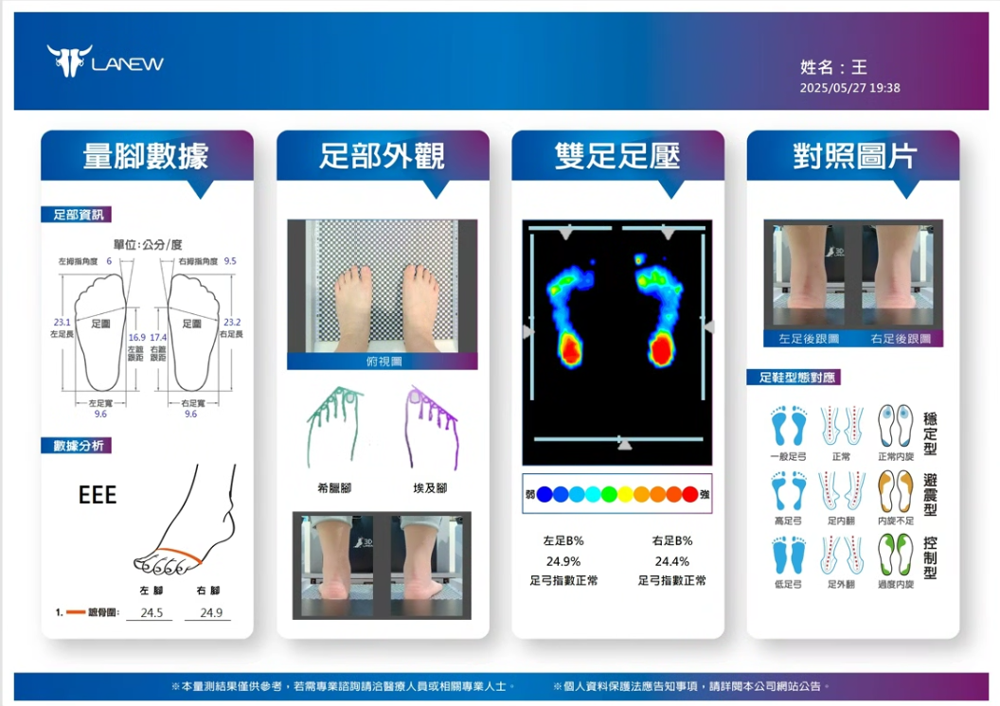

# LaNew 售鞋顧問

LaNew 售鞋顧問是一套用於門市導購情境的互動系統，協助導購人員根據足測結果、商品資訊與顧客需求生成可解釋的選鞋建議。系統接收足測欄位與當輪提問，整理出可判讀條件，並將商品證據收斂成顧客可以直接理解的推薦說明。

## Problem

在門市現場，足測報告本身並不等於推薦結果。顧客看到的是數值與欄位，真正需要被完成的，卻是尺寸判斷、支撐需求、材質偏好與穿著情境之間的連結。只要這段連結完全依賴導購人員臨場轉譯，同一份足測就可能在不同人手上得到不同解讀，推薦理由也會逐漸脫離商品證據本身。

真正的壓力出現在第二輪之後。當顧客從「我每天久站通勤，該選哪款」接著補充成「腳偏寬」或「想要正式外型」時，導購往往必須重新鋪陳一次判斷邏輯，才能把新的條件接回原本的推薦方向。門市對話因此變得冗長，推薦一致性也難以維持，最後受到影響的，是顧客對建議本身的信任。

## Solution

LaNew 以 Agentic SDK 支援的 workflow 重建整段導購主線，讓足測直接成為推薦流程的起點。系統先收進足測欄位與當輪提問，整理出需要被優先判讀的條件，再依條件決定應該補足哪些資訊、回查哪些鞋款，或重新排序候選商品，最後把這些證據收斂成顧客可以直接理解的推薦說明。

圖 1 所示的足測樣本，就是這條主線的起點。對系統來說，足弓狀態、受力分布、尺寸風險與使用需求並不是分開閱讀的欄位，而是會先被整理成同一輪推薦可以使用的條件，後續商品回查與推薦生成也都圍繞這組條件展開。

圖 1. LaNew 足測樣本輸入，用來呈現系統如何從足測欄位建立判讀條件，並回扣到鞋款支撐、尺寸與材質證據。

這種設計的價值，在於它支撐的是一段可以隨追問持續推進的導購流程。當顧客在下一輪補充新的穿著條件時，系統承接的是既有條件與商品證據，不必讓導購重新把足測意義與商品差異再解釋一次。

## Proof of Concept

## Playground Configuration

LaNew 範例的 Builder 設定採用意圖分流，而不是指定單一句型。目標是讓 Agent 可以處理門市現場的多元問法，同時維持兩個基本契約：分析型問題只回覆足測與條件判讀；決策型問題才提出可互動的下一步確認。

| 問題選項 | 詳細配置 |
| --- | --- |
| Q1 即時問答 | 預設問題可放兩類入口：`我的足測報告結果如何？`、`請為我推薦合適的鞋墊。` 第一類用來測分析回答，第二類用來測推薦與互動確認。 |
| Q2 整理文字與圖片 | 請根據使用者文字與足測圖片，整理足部量測數據、足部外觀、雙足足壓與左右腳差異。若圖片資訊不足，請明確說明不確定處，不要捏造數值。 |
| Q3 語意搜尋 | 上傳 `lanew_footwear_catalog.md`，搜尋目標為：查找 LaNew 產品資訊、鞋墊建議、適用條件、價格與商品編號。 |
| Q4 可互動元件 | 角色：你是 LaNew 鞋墊顧問。請先判斷使用者意圖。當使用者只是詢問足測結果、足部狀況、數據代表意義、壓力分布或判讀依據時，只回覆文字分析，不推薦產品，也不要詢問是否購買。當使用者明確要求推薦、比較、挑選、購買建議或下一步決策時，先根據足測報告與 LaNew 產品資料推薦合適鞋墊，說明推薦依據、商品名稱、價格、限制與下一步；只有在完成推薦並提出確認問題後，Playground 才依互動工具設定顯示確認元件。 |
| 互動工具 trigger | 僅在本輪已完成具體產品推薦，且需要使用者確認是否購買、保留推薦、送出需求或進入下一步時呼叫。若使用者只是要求分析、解釋、查詢足測結果或追問理由，不要呼叫工具。 |
| 互動工具欄位 | `是否進行下一步 = 使用者是否確認要購買、保留或送出本次推薦（資料類型：是/否）`。 |

這組配置不是把「我的足測報告結果如何？」寫成硬例外，而是把使用者意圖分為資訊型與決策型兩種開放類別。只要使用者是在問分析、原因、判讀或資料說明，Agent 應保留在文字回覆；當使用者要求推薦並需要確認下一步時，Playground 會在最終文字回覆後依互動工具設定補上確認元件，不需要依賴模型直接產生 tool call。

以「我每天久站通勤，該選哪款」為例，workflow 的第一輪任務，是先把足測報告與當輪需求收斂成同一段可推進的推薦流程。系統接到問題之後，會先從足弓狀態、受力分布、尺寸風險與使用情境整理出真正需要優先處理的條件，再沿著這組條件回查候選鞋款的支撐特性、楦頭設定與材質差異。最後得到的，不會只是商品資料的羅列，而是一段把足測欄位、鞋款證據與穿著需求整合過的推薦說明，讓顧客第一次就能理解這雙鞋為什麼被提出。表 1 整理了這一輪推薦流程中各模組的責任位置與交互參照。

| 模組 | 在此案例中的處理內容 |
| --- | --- |
| Perceive | 將足弓、受力、尺寸風險與使用需求整理成可判讀條件 |
| Plan | 依照這些條件決定本輪優先比對哪些鞋款，或還需要補問哪些資訊 |
| Retrieve | 帶回尺寸、支撐與材質等對應證據，形成後續推薦依據 |
| Action | 將條件與商品差異整理成顧客可理解的推薦說明 |
| Reflect | 檢查這一輪推薦說明是否已回應顧客條件，若不足則標出需要補回的商品證據或補問資訊 |

表 1. LaNew 推薦流程中的五模組交互參照，用來說明各模組在第一輪判讀中的責任位置。

推薦流程的穩定性，建立在足測條件、商品回查與推薦理由之間的連續對應。足弓狀態、受力分布、尺寸風險與使用需求會先被整理成同一組判讀條件，這組條件接著決定候選鞋款的比對方向，包括中底支撐、楦頭設定與材質差異。當相關證據被帶回來之後，系統再把條件與商品特性整理成顧客可以直接理解的推薦理由，讓整段導購從條件判讀一路收斂到商品選擇。

真正的 proof 出現在第二輪條件補充之後。當顧客接著說「腳偏寬」或補充「希望正式一點」時，系統不會把前一輪的判讀基礎全部清空，而會沿用 Perceive 已經整理出的足測條件、沿用 Retrieve 已帶回的商品證據，再由 Plan 重新排序這一輪最需要優先處理的判斷重點。Action 因此重組出的，不是另一段彼此獨立的商品說明，而是在既有脈絡上修正後的推薦理由。對顧客而言，這種承接能力比第一次回答更重要，因為它決定了這段導購流程能不能在連續追問中維持一致。

所以這個 PoC 最後證明的是，Agentic SDK 能把足測欄位、商品知識與連續提問維持在同一條可追溯的決策鏈上。只要條件改變之後，系統仍然能延續前一輪已建立的判讀基礎與商品證據，持續推進推薦理由，這條門市導購主線就算真正成立。

## Summary

LaNew 售鞋顧問這個案例最後建立的，是一套能在連續追問中維持推薦一致性的門市決策流程。對顧客來說，推薦理由不再停留在導購的主觀描述，而能始終回扣到足測條件與商品證據；對門市團隊來說，商品更新、話術調整與回應優化都可以在既有主線上持續演進，而不必每次都重寫整段導購邏輯。