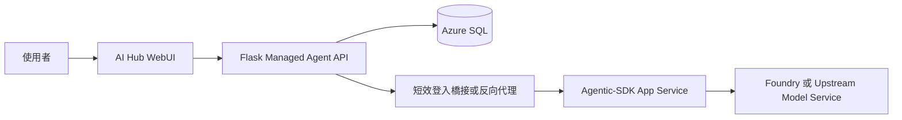

# 01 Target Architecture

## Architecture Goal

把 Agentic-SDK 從「直接對外暴露的 App Service demo runtime」調整為「由 AI Hub 管理身份、資料與入口的執行引擎 + Playground 體驗」。

## Recommended Boundary

### 1. AI Hub WebUI 作為 Identity Authority

AI Hub WebUI 應負責：

- 使用者登入 session。
- `app_user` 身份解析。
- 使用者身份權威與 owner resolution。
- Agent CRUD API。
- CSRF / session-based write protection。
- 與 SQL 的 owner-based data access。

### 2. Agentic-SDK 作為 Hosted Playground + System of Execution

Agentic-SDK 應負責：

- 線上 Playground UI 呈現與互動。
- workflow config 驗證。
- 五節點 workflow engine 執行。
- 對上游模型服務或 Foundry 的推論調用。
- telemetry / stream 事件輸出。
- 可被受管 API 呼叫的執行接口。

### 3. Azure SQL 作為 Agent Metadata Source of Truth

Azure SQL 應保存：

- Agent 所有權。
- Agent 核心配置。
- 更新時間與審計欄位。
- 可選的最近一次執行摘要或狀態指標。

第一階段不要把 SQL 當成完整 workflow event store；只保存需要跨登入續用的業務資料。

## Recommended Request Flow

## Why This Boundary

- 現有 ai-hub-webui 已有 session、`login_required`、SQL `app_user` 與 API write protection，可直接重用。
- 若把登入直接做進 Agentic-SDK FastAPI，會形成第二套 session、第二套路由保護與第二套資料所有權規則。
- 因為 Agentic-SDK 現況是獨立 App Service，直接共用 ai-hub-webui session cookie 不可靠，必須明確選擇入口收斂或 token bridge。
- 讓 AI Hub 保有身份權威，可以把 owner resolution、審計與 SQL 存取維持在單一邊界。

## Deployment Variants

### Variant A: Entry Consolidation

- 使用者從 ai-hub-webui 進入 Playground。
- AI Hub 反向代理或嵌入 Agentic-SDK UI。
- 同一個站點處理登入與大部分 API。

優點：

- 身份邊界最單純。
- 較容易沿用現有 session 與 CSRF。

代價：

- 需調整入口拓撲與前端資產掛載方式。

### Variant B: Trusted Token Exchange

- Agentic-SDK 維持獨立 App Service 網址。
- 使用者先在 AI Hub 登入。
- AI Hub 簽發短效 token 給 Agentic-SDK，用於識別 owner 與存取受管 API。

優點：

- 保留現有獨立部署模式。
- 對現有 Agentic-SDK App Service 變動較局部。

代價：

- 需額外設計 token 驗證、過期、撤銷與信任邊界。

若 CEO 尚未決定是否要收斂入口，RD 在藍圖階段應先把兩條路徑都估工，但第一階段實作只能選一條。

## Recommended Module Split

### A. AI Hub WebUI 新增模組

- `utils/agent_workspace/records.py`
  - Agent metadata CRUD。
- `utils/agent_workspace/service.py`
  - owner check、payload normalization、save/load orchestration。
- `utils/routes/agent_workspace_routes.py`
  - `/api/me/agents`
  - `/api/me/agents/<agent_id>`
  - `/api/me/agents/<agent_id>/run`
- `utils/routes/workspace_page_routes.py`
  - 新增登入後 Playground 頁面入口。

### B. Agentic-SDK 保持或新增的模組

- `agentic_sdk.gateway.routes_workflow`
  - 接受由受管 API 傳來的 workflow payload。
- `agentic_sdk.workflow.engine`
  - 維持 workflow orchestration，不承擔 owner auth。
- 可選新增 `agentic_sdk.gateway.execution_contracts`
  - 明確宣告 run request / result / telemetry metadata schema。

## Identity Propagation Contract

第一階段建議不要讓瀏覽器直接把 session cookie 帶去 FastAPI Gateway。

建議流程：

1. 瀏覽器呼叫 AI Hub Flask API。
2. Flask 從 session 取得 `username`、`display_name`、`role`。
3. Flask 載入對應 `agent_id` 的已保存配置。
4. Flask 以 server-to-server 方式呼叫 Agentic-SDK Gateway。
5. Gateway request metadata 附帶 `owner_username`、`agent_id`、`requested_by` 供 telemetry 與後續審計使用。

這樣可避免跨服務 cookie 信任與 CORS/session 混用問題。

## Invariants

1. 使用者不能直接藉由前端傳入 `owner_username` 來指定資料所有者。
2. `owner_username` 只能由 AI Hub 身份權威解析得出，或由其簽發的受信 token 推導得出。
3. Agentic-SDK 的 workflow engine 不應直接依賴 Flask session 物件。
4. SQL 中的 Agent 設定是 Playground 的持久化權威來源；FastAPI process memory 只作執行期快取。
5. 第一階段的公開展示與正式登入後工作區必須分流，不可共用同一條匿名寫入/執行路徑。

## Edge Cases

- 使用者 session 或 bridge token 過期後再次保存或執行，應回可辨識的重新登入或重新取得授權訊號。
- 已刪除 Agent 不得再被執行，即使前端仍持有舊 `agent_id`。
- SQL 暫時不可用時，應拒絕保存與載入；不得偷偷退回匿名本機檔案保存。
- 若 Gateway 暫時不可用，既有 Agent 設定仍應可載入與編輯，但執行按鈕需回明確錯誤。