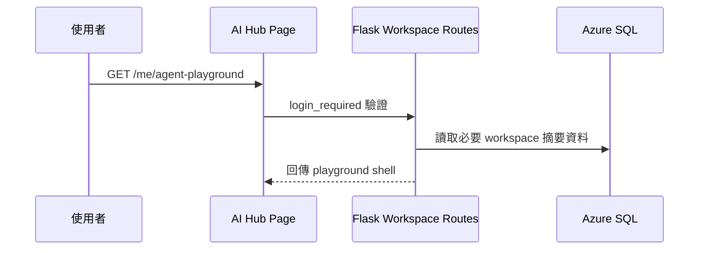
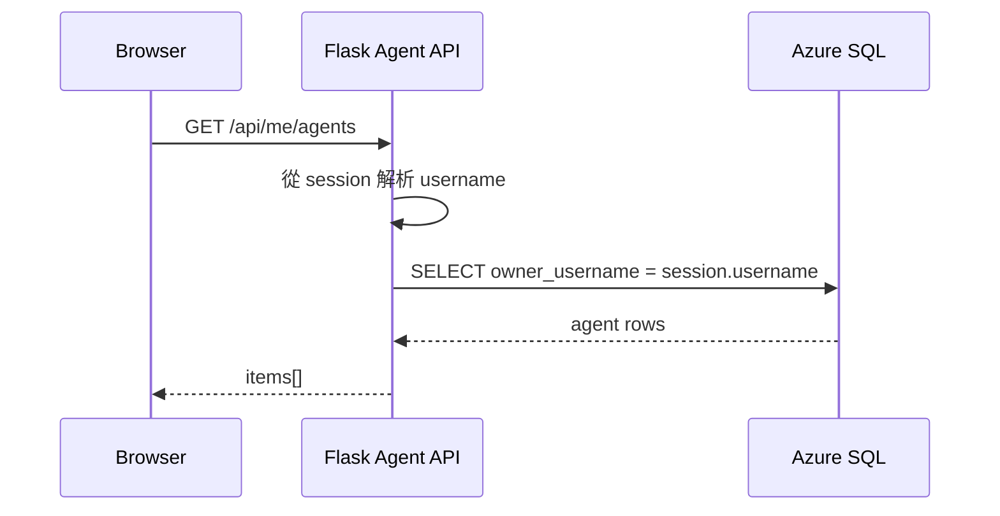
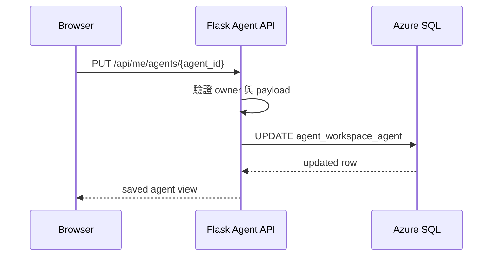
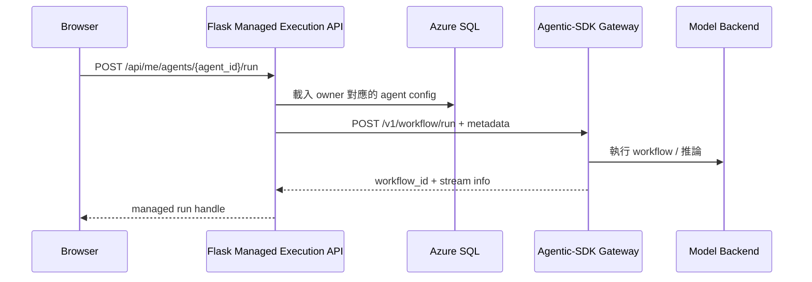

# 04 Entry Consolidation Blueprint

## Goal

本藍圖將第一階段正式方案固定為 `Entry Consolidation`：

- 使用者只從 AI Hub WebUI 進入受管 Playground。
- AI Hub WebUI 是唯一身份入口與 Agent metadata 權威。
- Agentic-SDK 保留獨立 App Service 作為執行引擎與可選展示站，不作為正式登入後工作區的身份權威。

## Product Boundary

### 正式使用路徑

- 入口：AI Hub 登入後工作區。
- 能力：建立個人 Agent、保存配置、載入配置、發起執行、查看最近狀態。
- 資料權威：AI Hub Azure SQL。

### 公開展示路徑

- 入口：既有 Agentic-SDK App Service 公開網址。
- 能力：展示產品能力、公開展示或有限匿名體驗，但不進入正式個人保存路徑。
- 限制：不得作為正式個人 Agent 保存入口。

這樣可將「產品展示」與「正式使用」分流，避免匿名 demo 與登入後資料路徑共用。

## Page Entry Blueprint

## 建議路由

掛在現有 workspace 模式下，維持與 `/guide`、`/my-deployments` 一致的登入保護與模板結構。

### 新頁面入口

- `GET /me/agent-playground`

建議責任：

- 驗證使用者已登入。
- 注入 workspace 導航共用資料。
- 提供 Playground shell 頁面。
- 頁面只載入 AI Hub 管理所需設定，不直接嵌入 owner identity 到可偽造的前端欄位。

### 建議模板位置

- `templates/pages/workspace/agent_playground.html`

### 建議導覽狀態

- `active_personal_panel="agent_playground"`
- `personal_panel_title="我的 Agent Playground"`
- `personal_panel_subtitle="建立、保存並續用你自己的 Agent 工作流。"`

### 第一階段 Agent 卡片欄位

- Agent 名稱
- 描述
- 最後更新時間
- 最後執行時間
- 執行後端（`upstream` / `foundry`）

## UI Composition

正式頁面不需要在第一階段重寫 Agentic-SDK 整套 React 編排器，但需要明確定義整合方式。

### 建議方案 A

由 AI Hub 頁面提供一個 Playground 容器，載入 Agentic-SDK 前端 bundle，並把資料交互改為走 AI Hub 受管 API。

必要條件：

- Agentic-SDK 前端 API base URL 可配置。
- 前端不得再假設直接呼叫 `/v1/workflow/*`。

### 建議方案 B

將 React bundle 納入 AI Hub 靜態資產或 workspace 子頁。

必要條件：

- 明確切分 UI bundle 與執行 API。
- 保持前端只知曉 AI Hub API，不知曉真正的 Gateway 祕密或 owner 規則。

第一階段較建議方案 A：變更較局部，仍保留 Agentic-SDK 前端獨立 build 能力。

## API Blueprint

## API 分層

### 1. Workspace Agent Metadata API

由 AI Hub Flask 提供，對瀏覽器公開。

- `GET /api/me/agents`
- `POST /api/me/agents`
- `GET /api/me/agents/<agent_id>`
- `PUT /api/me/agents/<agent_id>`
- `DELETE /api/me/agents/<agent_id>`

責任：

- 以 session 解析 owner。
- 驗證 payload。
- 讀寫 SQL Agent metadata。
- 回傳 workspace 所需視圖資料。

### 2. Workspace Managed Execution API

同樣由 AI Hub Flask 提供，對瀏覽器公開。

- `POST /api/me/agents/<agent_id>/run`
- `GET /api/me/agents/<agent_id>/runs/<workflow_id>/stream`
- `GET /api/me/agents/<agent_id>/runs/<workflow_id>/result`

責任：

- 以 owner + `agent_id` 載入已保存配置。
- 轉送執行請求到 Agentic-SDK Gateway。
- 將 stream/result 對瀏覽器代理成穩定路徑。
- 補上審計 metadata 與錯誤轉譯。

### 3. Agentic-SDK Internal Execution Contract

由 Flask server-to-server 呼叫 Agentic-SDK。

- `POST /v1/workflow/run`
- `GET /v1/workflow/<workflow_id>/stream`
- `GET /v1/workflow/<workflow_id>/result`

責任：

- 執行 workflow。
- 對上游模型服務或 Foundry 發送請求。
- 回傳 telemetry 與結果。

Agentic-SDK 不直接對瀏覽器執行 owner-based access control。

## End-to-End Data Flow

### Flow 1: 開啟 Playground



### Flow 2: 載入我的 Agent 清單



### Flow 3: 保存 Agent



  ### Flow 3.5: 刪除 Agent

  ```mermaid
  sequenceDiagram
    participant B as Browser
    participant F as Flask Agent API
    participant S as Azure SQL

    B->>B: 顯示刪除確認視窗
    B->>F: DELETE /api/me/agents/{agent_id}
    F->>F: 驗證 owner
    F->>S: DELETE FROM agent_workspace_agent
    S-->>F: delete success
    F-->>B: 204 No Content
  ```

### Flow 4: 執行已保存 Agent



## Module Split Blueprint

## AI Hub WebUI

### Route Layer

- `utils/routes/workspace_page_routes.py`
  - 新增 `agent_playground()` 頁面入口。
- `utils/routes/agent_workspace_routes.py`
  - 負責 `/api/me/agents*`。
- `utils/routes/agent_workspace_run_routes.py`
  - 負責 `/api/me/agents/<agent_id>/run`、stream、result。

若團隊偏好減少檔案數，metadata 與 execution routes 可先合併在 `agent_workspace_routes.py`，但仍要在 service 層分責。

### Service Layer

- `utils/agent_workspace/service.py`
  - owner 驗證。
  - payload normalization。
  - Agent CRUD orchestration。
  - 執行前載入配置與狀態檢查。
- `utils/agent_workspace/execution.py`
  - Gateway request 組裝。
  - stream/result 代理。
  - run metadata 對應。

### Record / Data Access Layer

- `utils/agent_workspace/records.py`
  - SQL CRUD。
  - row-to-dto mapping。
  - owner-scoped query。

### Presentation Layer

- `templates/pages/workspace/agent_playground.html`
- `static/js/agent-playground.js` 或對應 bundle 掛載點

責任邊界：

- Template / JS 不自行決定 owner。
- Service 層不直接回傳原始 SQL row 給模板。

## Agentic-SDK

### 保持不動或僅小改的模組

- `agentic_sdk.workflow.engine`
- `agentic_sdk.gateway.routes_workflow`
- `agentic_sdk.gateway.routes_telemetry`

### 建議新增或調整

- `agentic_sdk.gateway.execution_contracts`
  - 定義 Flask 對 Gateway 的 run request metadata shape。
- `demo/src/runtime/api.ts`
  - 支援可注入 managed API base URL。
- `demo/src/App.tsx`
  - 將直接呼叫 Gateway 的假設抽成可替換 adapter。

第一階段不要求 Agentic-SDK 直接理解 SQL 或 `app_user`。

## Public API Shape

### Page Route

`GET /me/agent-playground`

- Input: session cookie
- Output: HTML shell

### Metadata API

`GET /api/me/agents`

- Output: agent list summary

`PUT /api/me/agents/<agent_id>`

- Input: `agent_name`, `description`, `workflow_yaml`, `workflow_json`, `execution_backend`
- Output: normalized saved record

### Managed Run API

`POST /api/me/agents/<agent_id>/run`

- Input: `user_message`, optional `attachments`
- Output: `agent_id`, `workflow_id`, managed `stream_url`, `status`

## Invariants

1. 正式 Playground 只接受登入後的 AI Hub 使用者。
2. `owner_username` 永遠由 session 推導，不由前端送入。
3. 瀏覽器永遠只呼叫 AI Hub 受管 API，不直接呼叫正式 Gateway 寫入/執行端點。
4. Agent metadata 的權威來源是 Azure SQL，而不是 localStorage、process memory 或 SQLite fallback。
5. Agentic-SDK 執行失敗不應影響 Agent metadata 的可讀取性。
6. 同一位使用者的 Agent 名稱必須唯一。
7. 正式刪除採物理刪除，不保留 workspace 回收站狀態。
8. 前端執行刪除前必須先顯示確認視窗。

## Boundary Conditions

### 支援

- 單一使用者擁有多個個人 Agent。
- 重新登入後載入既有 Agent。
- 從已保存配置再次執行。

### 不支援

- 共編。
- 跨使用者分享。
- 匿名保存。
- 將正式 owner data 儲存在 Agentic-SDK 本地 SQLite。
- 第一階段執行摘要入庫。
- `workflow_json` 入庫。

## Verification Notes

### RD 完成後，QE 至少要驗證

1. 未登入進入 `/me/agent-playground` 會被導回登入。
2. 使用者 A 建立的 Agent 不會出現在使用者 B 的 `/api/me/agents`。
3. 前端即使手動提交偽造 `owner_username`，也不會覆寫資料所有權。
4. SQL 故障時，保存與載入回明確錯誤，不會落到匿名 fallback。
5. Gateway 故障時，Agent 清單仍可正常列出，但 run 會回明確錯誤。

## Recommended Implementation Order

1. 新增 workspace 頁面入口與空頁 shell。
2. 完成 SQL schema 與 `/api/me/agents` CRUD。
3. 將前端 save/load 切到 AI Hub API。
4. 再把 run / stream / result 改成受管代理。
5. 最後才處理匿名展示頁與正式工作區的分流文案。

## Handoff Package For Senior Software Engineer

- Module location
  - AI Hub：`utils/agent_workspace/*`、`utils/routes/agent_workspace*_routes.py`、`templates/pages/workspace/agent_playground.html`
  - Agentic-SDK：`demo/src/runtime/*` 與可選 `agentic_sdk.gateway.execution_contracts`

- Dependency direction
  - Template/JS -> Flask routes -> service -> records -> SQL
  - Flask execution service -> Agentic-SDK Gateway
  - Agentic-SDK workflow engine -> model backend

- Public API shape
  - `/me/agent-playground`
  - `/api/me/agents*`
  - `/api/me/agents/<agent_id>/run`

- Invariants
  - owner 只能由 AI Hub session 解析
  - 正式瀏覽器流量不直打 Gateway
  - SQL 是 Agent metadata source of truth