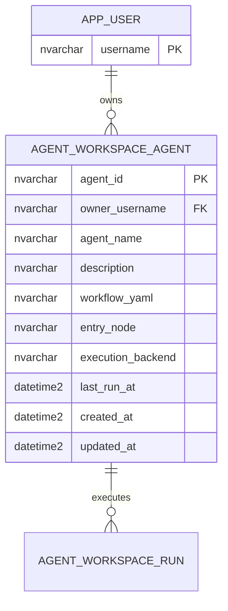

# 05 Database Architect Blueprint

## Scope

本文件是 `Entry Consolidation` 方案的 database-architect 交棒版，只處理第一階段為「個人 Agent 建立、保存、續用、執行」所需的持久層設計。

不包含：

- migration 實作碼
- query service 實作
- 多人共享與組織層權限
- 完整 run event store

## Schema Goal

在不破壞既有 `app_user` 權威來源的前提下，新增最小可驗收 schema，使 AI Hub 能：

- 以 `owner_username` 管理個人 Agent
- 保存 workflow 核心配置
- 支援重新登入後續用
- 為後續 run summary、配額、分享等能力留下可演進空間

## ER Model



## Normalization Decision

### 第一階段採用

- `agent_workspace_agent` 為主要實體表
- `agent_workspace_run` 延後，不納入第一階段

### 正規化取捨

- 第一階段只保存 `workflow_yaml`，不保存 `workflow_json`
- `execution_backend` 先以 CHECK vocabulary 管理，不另外建 lookup table
- 第一階段不保留 `status` 欄位；刪除直接採物理刪除

原因：

- 目前主要查詢路徑是「列出我的 Agent」與「讀取單一 Agent 詳細配置」
- 第一階段資料量可預期遠小於平台 catalog 或 model card 流程
- 避免為未驗證的版本控制或協作需求過度正規化

## Table Design

## Table: `agent_workspace_agent`

### Purpose

代表一個登入使用者所擁有的 Agent Playground 保存物件。

### Recommended Columns

- `agent_id NVARCHAR(64) NOT NULL PRIMARY KEY`
- `owner_username NVARCHAR(100) NOT NULL REFERENCES app_user(username) ON DELETE CASCADE`
- `agent_name NVARCHAR(200) NOT NULL`
- `description NVARCHAR(1000) NULL`
- `workflow_yaml NVARCHAR(MAX) NOT NULL`
- `entry_node NVARCHAR(60) NOT NULL DEFAULT 'perceive'`
- `execution_backend NVARCHAR(40) NOT NULL DEFAULT 'upstream'`
- `last_run_at DATETIME2 NULL`
- `created_at DATETIME2 NOT NULL DEFAULT SYSUTCDATETIME()`
- `updated_at DATETIME2 NOT NULL DEFAULT SYSUTCDATETIME()`

### Integrity Constraints

- `agent_name` NOT NULL
- `workflow_yaml` NOT NULL
- `entry_node` CHECK IN `('perceive', 'plan', 'retrieve', 'reflect', 'action')`
- `execution_backend` CHECK IN `('upstream', 'foundry')`
- `owner_username + agent_name` 唯一

### Notes

- 同一使用者不可建立同名 Agent
- 第一階段刪除採物理刪除；若將來要回收站或封存，再回來補 `status` 欄位

## Table: `agent_workspace_run`

此表延後到後續階段，第一階段不建立。

## Index Strategy

## `agent_workspace_agent`

### Required Indexes

1. `idx_agent_workspace_agent_owner_updated`
   - Key: `(owner_username, updated_at DESC)`
   - 用途：列出「我的 Agent」

2. `uq_agent_workspace_agent_owner_name`
   - Key: `(owner_username, agent_name)`
   - 用途：強制同一 owner 不可重名，同時支援搜尋

### Tradeoff

- 這些索引會增加寫入成本，但第一階段主要使用模式是低頻保存、高頻列表與載入，值得接受

## `agent_workspace_run`

第一階段不建立，因此不配置索引。

## Transaction Boundaries

## Transaction A: Create Agent

原子性要求：

- 建立 Agent row 必須一次成功或失敗

不需要跨表交易，除非同時建立預設 run summary 或 audit row。

## Transaction B: Update Agent

原子性要求：

- `workflow_yaml`、`workflow_json`、`updated_at` 必須同一交易提交

若採 optimistic concurrency，可再加 `updated_at` compare-and-swap 條件；第一階段非必要。

## Transaction C: Start Run

第一階段沒有 run table：

- 只更新 `agent_workspace_agent.last_run_at`

## Transaction D: Finish Run

第一階段不需要 finish-run 摘要更新交易。

## Migration Compatibility Notes

## 與既有 schema 的關係

- `owner_username` 應直接對接現有 `app_user.username`
- 命名風格延續既有 `model_card_draft.owner_username`、`platform_solution.owner_username`
- DDL 風格應延續 `utils/db.py` 現有 runtime bootstrap 模式

## `db.py` 風格 DDL 草案

以下草案刻意對齊 `utils/db.py` 目前的慣例：

- DDL 常數採全大寫底線命名
- `CREATE TABLE` 用 `IF OBJECT_ID(..., N'U') IS NULL`
- index 用 `IF NOT EXISTS (SELECT 1 FROM sys.indexes ...)`
- schema bootstrap 由 `_ensure_*_schema(conn)` 統一執行

### 建議主表常數

```python
_AGENT_WORKSPACE_AGENT_SCHEMA = """
      IF OBJECT_ID(N'dbo.agent_workspace_agent', N'U') IS NULL
      BEGIN
         CREATE TABLE agent_workspace_agent (
            agent_id NVARCHAR(64) NOT NULL PRIMARY KEY,
            owner_username NVARCHAR(100) NOT NULL REFERENCES app_user(username) ON DELETE CASCADE,
            agent_name NVARCHAR(200) NOT NULL,
            description NVARCHAR(1000),
            workflow_yaml NVARCHAR(MAX) NOT NULL,
            entry_node NVARCHAR(60) NOT NULL DEFAULT 'perceive' CHECK (entry_node IN ('perceive', 'plan', 'retrieve', 'reflect', 'action')),
            execution_backend NVARCHAR(40) NOT NULL DEFAULT 'upstream' CHECK (execution_backend IN ('upstream', 'foundry')),
            last_run_at DATETIME2 NULL,
            created_at DATETIME2 NOT NULL DEFAULT SYSUTCDATETIME(),
            updated_at DATETIME2 NOT NULL DEFAULT SYSUTCDATETIME()
         )
      END
   """
```

### 第一階段已決議同一 owner 不可同名，建議補唯一約束常數

```python
_UQ_AGENT_WORKSPACE_AGENT_OWNER_NAME = """
      IF NOT EXISTS (
         SELECT 1
         FROM sys.indexes
         WHERE name = 'uq_agent_workspace_agent_owner_name'
           AND object_id = OBJECT_ID(N'dbo.agent_workspace_agent')
      )
      BEGIN
         CREATE UNIQUE INDEX uq_agent_workspace_agent_owner_name
         ON agent_workspace_agent(owner_username, agent_name)
         WHERE status <> 'deleted'
      END
   """
```

註：因第一階段採物理刪除，且不保留 `status` 欄位，不需要 filtered unique index。可直接使用一般唯一索引。

```python
_UQ_AGENT_WORKSPACE_AGENT_OWNER_NAME = """
      IF NOT EXISTS (
         SELECT 1
         FROM sys.indexes
         WHERE name = 'uq_agent_workspace_agent_owner_name'
           AND object_id = OBJECT_ID(N'dbo.agent_workspace_agent')
      )
      BEGIN
         CREATE UNIQUE INDEX uq_agent_workspace_agent_owner_name
         ON agent_workspace_agent(owner_username, agent_name)
      END
   """
```

### run 摘要表常數

第一階段不建議加入 `db.py`。

若第二階段需要執行歷史，再把 `_AGENT_WORKSPACE_RUN_SCHEMA` 與相關索引常數納入。

### 建議索引常數

```python
_IDX_AGENT_WORKSPACE_AGENT_OWNER_UPDATED = """
      IF NOT EXISTS (SELECT 1 FROM sys.indexes WHERE name = 'idx_agent_workspace_agent_owner_updated' AND object_id = OBJECT_ID(N'dbo.agent_workspace_agent'))
      BEGIN
         CREATE INDEX idx_agent_workspace_agent_owner_updated
         ON agent_workspace_agent(owner_username, updated_at DESC)
      END
   """

_IDX_AGENT_WORKSPACE_AGENT_OWNER_NAME = """
      IF NOT EXISTS (SELECT 1 FROM sys.indexes WHERE name = 'idx_agent_workspace_agent_owner_name' AND object_id = OBJECT_ID(N'dbo.agent_workspace_agent'))
      BEGIN
         CREATE INDEX idx_agent_workspace_agent_owner_name
         ON agent_workspace_agent(owner_username, agent_name)
      END
   """
```

### 建議 bootstrap 函式草案

```python
def _ensure_agent_workspace_schema(conn):
   _ensure_app_user_schema(conn)
   with conn.cursor() as cur:
      cur.execute(_AGENT_WORKSPACE_AGENT_SCHEMA)
      cur.execute(_UQ_AGENT_WORKSPACE_AGENT_OWNER_NAME)
      cur.execute(_IDX_AGENT_WORKSPACE_AGENT_OWNER_UPDATED)
      cur.execute(_IDX_AGENT_WORKSPACE_AGENT_OWNER_NAME)
   _commit_schema_changes(conn)
```

### 建議掛載位置

- 若 Agent Workspace 被視為 app user/workspace 的延伸，可由新的 `_ensure_agent_workspace_schema(conn)` 單獨存在，並在使用 Agent workspace 功能的 records/service 進入前呼叫。
- 不建議把它直接塞進 `_ensure_app_user_schema(conn)`，避免所有登入路徑都無差別執行更多 schema bootstrap。

### 建議欄位調整策略

若第一版先不上 `agent_workspace_run`，但未來要追加欄位，延續 `db.py` 現況可用以下模式：

```python
_AGENT_WORKSPACE_AGENT_LAST_RUN_AT_COLUMN = """
      IF NOT EXISTS (SELECT 1 FROM sys.columns WHERE object_id = OBJECT_ID(N'dbo.agent_workspace_agent') AND name = 'last_run_at')
      BEGIN
         ALTER TABLE agent_workspace_agent ADD last_run_at DATETIME2 NULL
      END
   """
```

這樣可在不重建表的前提下演進 schema。

## Backfill 需求

- 第一階段不需要歷史資料 backfill
- 若先前匿名 demo 有 local file 或 SQLite 保存資料，不建議自動轉換到正式 SQL，避免所有權不明資料混入

## Deferred Decisions

1. `updated_at` 未來是否要加 optimistic concurrency compare-and-swap
2. 未來若要封存或回收站，是否重新引入 `status` 欄位
3. 未來前端編輯體驗是否需要重新引入 `workflow_json` cache 欄位

## Schema Facts Package For Engineer / QE

- Entities and relationships
  - `app_user` 1:N `agent_workspace_agent`

- Keys and constraints
  - Agent 以 `agent_id` 為 PK，owner 以 FK 指向 `app_user`
   - 同一 owner 的 `agent_name` 唯一
  - 所有 owner-scoped 讀寫必須以 session 對應 owner 為界

- Index strategy
   - 先優化 owner list、single-agent load、同名檢查

- Transaction boundaries
  - Create/update agent 原子提交
   - workflow execution 不與長交易綁定；第一階段只在 Agent row 更新 `last_run_at`

- Migration path
  - 以 runtime bootstrap 新增，不需 backfill 舊匿名資料

## Phase 1 Locked Decisions

- 不建立 `agent_workspace_run`
- 同一位使用者的 Agent 名稱必須唯一
- 刪除採物理刪除
- `workflow_yaml` 是正式權威來源
- 不保留 `status` 欄位
- 不保存 `workflow_json`
- 第一階段不限制每位使用者可建立的 Agent 數量