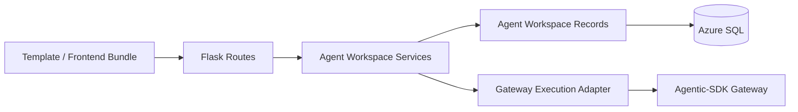

# 06 Senior Software Engineer Blueprint

## Scope

本文件是 `Entry Consolidation` 方案的 senior-software-engineer 交棒版，目標是把既有架構藍圖轉成第一批可實作的程式切片。

此文件回答四件事：

1. 第一批要改哪些檔案
2. 檔案責任如何切分
3. 實作順序怎麼排才最小可驗證
4. 每一刀改完要用什麼窄驗證方式確認沒有跑偏

## Implementation Goal

第一階段最小可驗收成果：

- 有登入後頁面入口
- 有個人 Agent CRUD API
- Agent metadata 可存回 SQL
- 前端 save/load 改走 AI Hub API
- run 路徑由 AI Hub 代理到 Agentic-SDK Gateway
- 刪除前有確認視窗

## Dependency Direction

工程師不得讓：

- template 或 JS 自行決定 owner
- records 層知道 Flask session
- Agentic-SDK 反向依賴 AI Hub Flask 物件

## File Plan

## AI Hub WebUI

### New Files

- `utils/agent_workspace/__init__.py`
- `utils/agent_workspace/records.py`
- `utils/agent_workspace/service.py`
- `utils/agent_workspace/execution.py`
- `utils/routes/agent_workspace_routes.py`
- `templates/pages/workspace/agent_playground.html`

第一階段頁面需提供 Agent 卡片欄位：

- Agent 名稱
- 描述
- 最後更新時間
- 最後執行時間
- 執行後端（`upstream` / `foundry`）

### Touched Existing Files

- `utils/db.py`
  - 新增 schema bootstrap 常數與 `_ensure_*` 掛載
- `utils/routes/workspace_page_routes.py`
  - 新增 `GET /me/agent-playground`
- `utils/routes/__init__.py`
  - 註冊 `register_agent_workspace_routes`

### Optional Frontend Integration Files

- `static/js/agent-playground.js`
  - 若以 AI Hub 頁面掛載外部 bundle 或提供 bridge config

## Agentic-SDK

### Touched Files

- `demo/src/runtime/api.ts`
  - 將 API base URL 抽成可注入 managed endpoint
- `demo/src/App.tsx`
  - 把直接對 Gateway 的呼叫抽為 adapter

### Optional New File

- `agentic_sdk/gateway/execution_contracts.py`
  - 明確定義 managed run metadata shape

## Module Responsibilities

## `utils/agent_workspace/records.py`

只負責資料存取：

- `list_agents(owner_username)`
- `get_agent(owner_username, agent_id)`
- `create_agent(...)`
- `update_agent(...)`
- `delete_agent(...)`

第一階段不要做：

- `create_run_summary(...)`
- `complete_run_summary(...)`

不要做：

- request parsing
- session reading
- response shaping for templates

## `utils/agent_workspace/service.py`

負責業務邏輯：

- payload validation
- ownership checks
- status transition checks
- normalize save payload
- 將 DB row 映射成 API DTO

第一階段 DTO 不包含 `workflow_json` persisted field。

建議對外函式：

- `list_my_agents(username)`
- `load_my_agent(username, agent_id)`
- `create_my_agent(username, body)`
- `update_my_agent(username, agent_id, body)`
- `delete_my_agent(username, agent_id)`

## `utils/agent_workspace/execution.py`

負責執行代理：

- 由 `agent_id` 載入 workflow config
- 組合 Gateway run payload
- 發送到 Agentic-SDK Gateway
- 轉譯錯誤
- 代理 stream/result

建議對外函式：

- `start_agent_run(username, agent_id, body)`
- `stream_agent_run(username, agent_id, workflow_id)`
- `load_agent_run_result(username, agent_id, workflow_id)`

## `utils/routes/agent_workspace_routes.py`

負責 HTTP 層：

- request JSON 解析
- login_required 保護
- 呼叫 service / execution
- error envelope 對齊既有 `/api/**` 格式

不要做：

- 直接寫 SQL
- 直接拼 workflow payload business rules

## Public API Shape

### Page

- `GET /me/agent-playground`

### Metadata API

- `GET /api/me/agents`
- `POST /api/me/agents`
- `GET /api/me/agents/<agent_id>`
- `PUT /api/me/agents/<agent_id>`
- `DELETE /api/me/agents/<agent_id>`

### Managed Run API

- `POST /api/me/agents/<agent_id>/run`
- `GET /api/me/agents/<agent_id>/runs/<workflow_id>/stream`
- `GET /api/me/agents/<agent_id>/runs/<workflow_id>/result`

## Suggested Slice Order

## Slice 1: Schema + Empty Page Route

改動：

- `utils/db.py`
- `utils/routes/workspace_page_routes.py`
- `templates/pages/workspace/agent_playground.html`

完成條件：

- 登入後可打開 `/me/agent-playground`
- SQL schema bootstrap 已存在

最窄驗證：

- workspace 頁面路由相關測試或最小 Flask route test

## Slice 2: Agent Metadata Records + Service

改動：

- `utils/agent_workspace/records.py`
- `utils/agent_workspace/service.py`

完成條件：

- 可在 service 層建立、讀取、更新、刪除 Agent
- owner scope 正確

最窄驗證：

- service / records unit tests，特別是 owner boundary

## Slice 3: Agent Metadata API

改動：

- `utils/routes/agent_workspace_routes.py`
- `utils/routes/__init__.py`

完成條件：

- `/api/me/agents*` 可用
- 錯誤 envelope 對齊現有 API 規範

最窄驗證：

- Flask route tests for CRUD + unauthorized + cross-owner access
- Flask route tests for delete confirmation-related API path assumptions remain server-safe even if client confirms before send

## Slice 4: Frontend Save / Load Integration

改動：

- `templates/pages/workspace/agent_playground.html`
- `static/js/agent-playground.js` 或 Agentic-SDK bundle config
- `Agentic-SDK/demo/src/runtime/api.ts`

完成條件：

- 前端可以列出、載入、保存我的 Agent
- 不再依賴 local-only save path

最窄驗證：

- 受影響前端最小 test 或型別檢查

## Slice 5: Managed Run Proxy

改動：

- `utils/agent_workspace/execution.py`
- `utils/routes/agent_workspace_routes.py`
- `Agentic-SDK/demo/src/App.tsx`

完成條件：

- run / stream / result 走 AI Hub API
- owner metadata 帶入 Gateway request

最窄驗證：

- Flask route tests with mocked Gateway client
- Agentic-SDK 前端相關型別檢查或小範圍測試

## Proposed Naming

### DTO / Record Names

- `AgentWorkspaceRecord`
- `AgentWorkspaceSummary`
- `AgentWorkspaceDetail`
- `AgentWorkspaceRunHandle`

### Error Codes

- `AGENT_NOT_FOUND`
- `AGENT_PAYLOAD_INVALID`
- `AGENT_ACCESS_DENIED`
- `AGENT_RUN_START_FAILED`
- `AGENT_RUN_RESULT_NOT_FOUND`

命名原則：沿用現有 `MODEL_CARD_*` 風格，避免混入過度泛化的 `RESOURCE_NOT_FOUND`。

## Invariants To Protect In Code

1. route 層只從 `session['username']` 取得 owner
2. service 層所有讀寫都要帶 `username`
3. records 層所有查詢都要有 owner scope，不能先以 `agent_id` 裸查再於上層過濾
4. execution 層不能接受前端自帶 `workflow_yaml` 覆蓋已保存 Agent，除非產品後續明確允許「未保存即執行」模式
5. Gateway 失敗時只影響 run，不回滾已保存的 Agent metadata
6. 同一位使用者的 Agent 名稱重複時，必須回明確錯誤，不自動改名
7. 刪除為物理刪除，不做 workspace 回收站狀態
8. schema 與 DTO 不保存 `workflow_json`

## Boundary Conditions

### Must Handle

- 未登入請求
- 不存在的 `agent_id`
- 不屬於該 owner 的 `agent_id`
- SQL 暫時不可用
- Gateway 暫時不可用
- `workflow_yaml` 空字串或非法 payload
- 使用者在前端刪除前取消確認視窗

### Do Not Implement In Phase 1

- 多人共享
- 版本歷史
- local file import/export 與正式 SQL 權威混用
- 跨頁面自動同步編輯衝突處理
- run summary 入庫
- `workflow_json` 入庫

## Phase 1 Locked Decisions

- 同一位使用者的 Agent 名稱必須唯一
- 刪除採物理刪除
- `workflow_yaml` 是唯一入庫的權威來源
- 不建立 run summary table
- 公開站保留展示，但正式保存與正式使用只走 AI Hub 工作區
- 第一階段不限制每位使用者可建立的 Agent 數量

## Suggested Test Inventory

### Backend Unit / Route Tests

- create/list/update/delete my agent
- user A cannot read user B agent
- run API loads saved agent instead of trusting client-supplied owner
- API error envelope shape remains `{ error: { code, message, reason? } }`

### Frontend Narrow Checks

- managed API base URL injection works
- save/load button points to AI Hub API, not direct Gateway
- run action now calls managed run route

## Local Risks / Assumptions

1. Agentic-SDK 現有前端假設直接打 Gateway，抽 adapter 時可能牽動 SSE handling
2. 若 `workflow_json` 與 `workflow_yaml` 都保存，需明確誰是 source of truth
3. 若 workspace 頁面要直接掛 React bundle，build 與靜態檔引用路徑需要額外確認

## Engineer Handoff Summary

- Implemented files target
  - AI Hub: `utils/agent_workspace/*`, `utils/routes/agent_workspace_routes.py`, `templates/pages/workspace/agent_playground.html`
  - Agentic-SDK: `demo/src/runtime/api.ts`, `demo/src/App.tsx`

- First executable validation after first edit
  - route or service-scoped tests for the touched slice

- Risks to escalate early
  - React bundle integration path
  - run stream proxy shape
  - YAML vs JSON source of truth